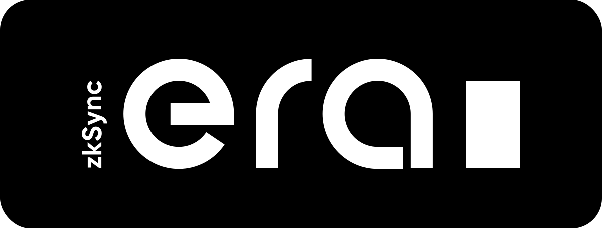

# ZKsync Era: Solidity Compiler

ZKsync Era is a layer 2 rollup that uses zero-knowledge proofs to scale Ethereum without compromising on security
or decentralization. As it's EVM-compatible (with Solidity/Vyper), 99% of Ethereum projects can redeploy without
needing to refactor or re-audit any code. ZKsync Era also uses an LLVM-based compiler that will eventually enable
developers to write smart contracts in popular languages such as C++ and Rust.

This repository contains the Solidity compiler and language tuned for EraVM.

## License

Solidity is licensed under [GNU General Public License v3.0](LICENSE.txt).

Some third-party code has its [own licensing terms](cmake/templates/license.h.in).

## Official Links

- [Website](https://zksync.io/)
- [GitHub](https://github.com/matter-labs)
- [Twitter](https://twitter.com/zksync)
- [Twitter for Devs](https://twitter.com/zkSyncDevs)
- [Discord](https://join.zksync.dev/)

## Disclaimer

ZKsync Era has been through extensive testing and audits, and although it is live, it is still in alpha state and
will undergo further audits and bug bounty programs. We would love to hear our community's thoughts and suggestions
about it!
It's important to note that forking it now could potentially lead to missing important
security updates, critical features, and performance improvements.
